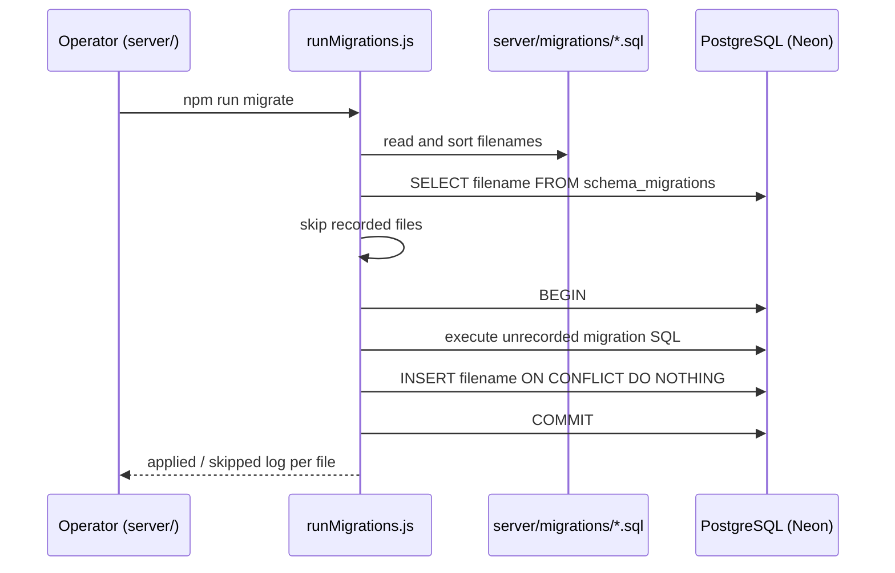

# Database Migrations

## Migration Strategy

Migrations are plain numbered `.sql` files in `server/migrations/`, applied to
the Neon Tech PostgreSQL database by the migration runner
`server/scripts/runMigrations.js`. The `schema_migrations` table, created by
migration 000, records the filename of every applied migration.

## Naming Convention

```
NNN_YYYYMMDD_description.sql
```

- **NNN** — zero-padded sequence number (000, 001, 002, ...)
- **YYYYMMDD** — date the migration was authored
- **description** — short snake_case summary of the change

## Applying Migrations

The single supported command, run from `server/`:

```bash
npm run migrate
```

It expands to:

```bash
node --env-file-if-exists=.env scripts/runMigrations.js
```

This command requires Node 22.9 or newer, because `--env-file-if-exists` does
not exist in earlier releases. The project owner runs Node 22.17 locally.

Environment resolution, in order:

1. A `DATABASE_URL` that is already exported in the shell is honored and wins
   over the value in the file.
2. Otherwise `server/.env` is loaded when it exists.
3. No `.env` file is required when `DATABASE_URL` is already exported.
4. Never commit `.env` files.

## What the Runner Does

`runMigrations.js`:

1. Reads every `.sql` filename in `server/migrations/` and sorts them by the
   zero-padded `NNN` prefix.
2. Reads the already-applied filenames from `schema_migrations`. When the table
   does not exist yet (before migration 000 creates it), it starts from an
   empty set.
3. Skips every file already recorded, logging `[migration] skipping: <file>`.
4. Wraps each unrecorded file in `BEGIN` / `COMMIT`, logging
   `[migration] applying: <file>`.
5. After the file's SQL succeeds, records the filename in `schema_migrations`
   through a parameterized insert with `ON CONFLICT DO NOTHING`, inside the
   same transaction.
6. On failure, prints `[migration] failed: <message>` and stops with exit code
   1. PostgreSQL rolls back the failing file's transaction; files applied
   before it stay applied and recorded.

## Operator Verification

After the runner finishes, inspect the tracking table:

```sql
SELECT * FROM schema_migrations ORDER BY id;
```

Then inspect the object or constraint the migration created (for example with
`\d table_name` in `psql`) to confirm it has the expected shape.

Never insert tracking rows into `schema_migrations` by hand. The runner is the
only writer of that table.

## Idempotency

All migrations use `CREATE TABLE IF NOT EXISTS`, `CREATE INDEX IF NOT EXISTS`,
`CREATE OR REPLACE FUNCTION`, and `DROP TRIGGER IF EXISTS` guards. They can be
safely re-run without causing errors or duplicate objects.

## Rollback Strategy

There is no automated rollback mechanism. Any destructive or manual reversal
must go through a reviewed SQL migration or an approved runbook, preceded by a
backup and a review of the affected data, and must have explicit owner
confirmation before it runs.

Never delete rows from `schema_migrations` to "re-run" a migration. Write a new
migration instead.

## Testing Migrations

Before applying migrations to production:

1. Spin up a local PostgreSQL instance or create a temporary Neon branch.
2. Run `npm run migrate` from `server/` with `DATABASE_URL` exported to that
   scratch target.
3. Verify the schema with `\dt` (list tables) and `\d table_name` (describe).
4. Run the application test suite against the migrated database.

## Connection Pool Usage

Import the singleton pool from `server/src/config/database.js` in any
repository module:

```js
import pool from "../config/database.js";

const result = await pool.query("SELECT * FROM users WHERE firebase_uid = $1", [
  uid,
]);
```

The pool is stored on `globalThis` so it survives Vercel serverless warm starts
without creating duplicate connections.

## Environment Variables

| Variable       | Description                            |
| -------------- | -------------------------------------- |
| `DATABASE_URL` | Neon Tech PostgreSQL connection string |

Format:

```
postgresql://<user>:<password>@<host>/<database>?sslmode=require
```

Set this variable in `server/.env` for local development and in Vercel project
settings for deployed environments. **Never commit `.env` files.**

## Schema Diagram



## Orphan-Row Cleanup Runbook

An **orphan user** is a row in the `users` table that has no matching row in
`user_profiles` (i.e., a `LEFT JOIN` on `user_profiles.user_id = users.firebase_uid`
returns `NULL`). This can occur when `createUser` inserts into `users` but a
subsequent Firebase lookup fails before `upsertProfile` runs. Orphan rows have
no completed profile and cannot log in normally.

> ⚠️ **This operation is irreversible. Always run the audit (dry-run) first
> and review the output before applying.**

### Step 1 — Audit (dry-run, no changes)

```bash
DATABASE_URL="postgresql://..." node server/scripts/cleanupOrphanUsers.js --dry-run
```

The script prints the count and `firebase_uid` values of all orphan rows and
exits without making any database changes.

### Step 2 — Apply (destructive delete)

Only run this after reviewing the dry-run output and confirming the targeted
rows are safe to remove.

```bash
DATABASE_URL="postgresql://..." node server/scripts/cleanupOrphanUsers.js --apply
```

The script deletes the identified orphan `users` rows and prints the count of
deleted rows.

### Notes

- The script is located at `server/scripts/cleanupOrphanUsers.js`.
- `DATABASE_URL` must be set; the script exits with code 1 if it is missing.
- Only rows with **no** `user_profiles` entry are targeted. Non-orphan users
  and their profiles are never touched.
- Because `user_profiles.user_id` has a `RESTRICT` FK to `users.firebase_uid`,
  orphan users (by definition lacking a profile) also have no dependent
  `contact_requests` or `questions` rows, making the delete safe.
